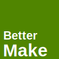

# BetterMake  
__A Build tool for C C++ ObjC & ObjC++ projects.__   
__Have something you'd like to see added, make an issue! or email [willdev2025@outlook.com](mailto:willdev2025@outlook.com)__  
  
> [!IMPORTANT]
> Required Things
> 
> [java (21 or Later)](https://adoptium.net/temurin/releases/?package=jdk&version=21)  
> [git (if using git)](https://git-scm.com/downloads)  
> [bash (if using git or project generator)](https://www.gnu.org/software/bash/)
  
  
# Info  
### General
> ✅ [Features](Docs/FEATURES.md)  
> 🏎️ [Running](Docs/RUNNING.md)   
### Configuration  
> 🪪 [Profiles](Docs/PROFILES.md)  
> ⚙️ [Configuration](Docs/CONFIG.md)  
> 🏛️ [Project Structure](Docs/PROJ_STRUCT.md)
### Dev
> 🧾 [TODO](Docs/TODO.md)  
> 👷‍♂️ [Contributing Guide](CONTRIBUTING.md)  
> 📘 [Style Guide](Docs/STYLE.md)  

# [License](LICENSE)
BetterMake - A Build Tool for C, C++, ObjC, ObjC++  
Copyright (C) 2025  Wdboyes13  
  
This program is free software: you can redistribute it and/or modify  
it under the terms of the GNU General Public License as published by  
the Free Software Foundation, either version 3 of the License, or any later version.  
  
This program is distributed in the hope that it will be useful,  
but WITHOUT ANY WARRANTY; without even the implied warranty of  
MERCHANTABILITY or FITNESS FOR A PARTICULAR PURPOSE.  See the  
GNU General Public License for more details.  
  
You should have received a copy of the GNU General Public License  
along with this program.  If not, see https://www.gnu.org/licenses/.  
    
